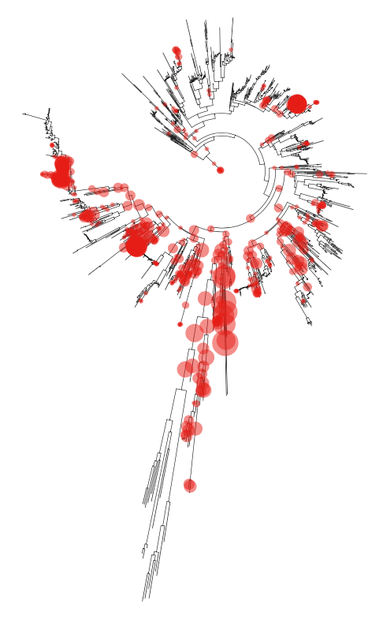

# Metabarcoding algae from rbcl 

Differences to discuss:
- Specifying multiple forward/reverse primers vs primer pair with wobble for rbcl
- Choosing the ```--p-trunc-len-f``` and ```--p-trunc-len-r``` from the quality plots. This step has the potential to impact results across workflows/users. 
    - Truncating too short --> reads will not merge up. 
    - Truncating too long --> more ASVs due to more sequencing errors at ends of reads. 
    - 

to do:
- add diat.barcode tree and reference database 
- add qiime2 and tronko taxonomy assignment workflow
- add sample dataset for compare Susie/Jeff workflow

### methods comparison
Pipeline for evaluating diversity, assigning taxonomy, and differential abundance testing of algae samples with rbcl amplicons (vers) with the diat.barcode reference database. Raw sequence data is processed to ASVs with DADA/Qiime2. Taxonomy assignments are compared between vsearch (Qiime2), command line BLAST, and Tronko (a recent phylogenetic approach to taxonomy assignment). The conda environment for the pipeline is [here](qiime2-env.yml)   

## Duplicate the qiime conda environment
```
conda env create -f qiime2-env.yml  
conda activate qiime2  
```
## Overview of pipeline

## FASTQ sample QA/QC

- The 2-color chemistry of recent illumina sequencing platforms results in long, poly-g tails added to sequenced fragments that are less than 250-bp ling. Fastp can trim off the poly-G tails reads and toss those that are below a threshold (usually the primer-dimer reads that are trimmed to ~75-bp or so)
- Qiime imports the directory of poly-G trimmed FASTQ files into a single 'qiime file' with the 'qza' extension. Using the primer sequence, qiime's 'cutadapt' plugin removes the primer and adapters of each pair of sequences. A second 'qza' output file is created for the cutadapt trimmed data.
- Qiime also calls the program [cutadapt](web address) filter out reads that do not have the primer sequence, and to trim off the sequences from reads that do. 

#### How do our pipelines differ?
[] The default threshold for filtering reads without the primer site ```--p-error-rate``` is 0.1. Discuss when this should be adjusted?
[] The rbcl primer set that we use has multiple forward and reverse primers, as well as degenerate bases. Jeff's pipeline specifies these in the cutadapt step with:

```
    --p-front-f AGGTGAAGTAAAAGGTTCWTACTTAAA
    --p-front-f AGGTGAAGTTAAAGGTTCWTAYTTAAA
    --p-front-f AGGTGAAACTAAAGGTTCWTACTTAAA
    --p-front-r CCTTCTAATTTACCWACWACTG
    --p-front-r CCTTCTAATTTACCWACAACAG
```

## Denoising 
- Sequences can be denoised using qiime, which calls the R package 'dada2'. Denoising learns the error rate from the base call quality of the samples, and tries to fix sequencing errors when possible. 
- Read pairs are merged into a single sequence when they sufficiently overlap and align. The ```--p-min-overlap``` is set to 12 by default. 
- Denoising output is another qiime object that contains a table of the counts for each unique sequence (called ASVs, rows of table) found among the samples (columns, each sample name taken from the fastqs). The ASV sequences and the ASV ids are stored in the 'rep-seqs.qza'. The table of counts for each ASV is stored in the 'feat-table.qza' file. Both objects can be exported to a human readable format (FASTA) to visually inspect the sequences and tables. Or, qiime has a number of summary functions that can be applied to the qza files. Qiime summaries and plots can be viewed [here](https://view.qiime2.org)

#### Input: samples.fq.gz
#### Output: rep-seqs.qza (ASVs) and feature-table.qza (per sample ASV counts)

## Taxonomy assignment 
Taxonomy assignment can be performed several ways. We've found that the best taxonomy assignment strategy differs between metabarcoding loci and sample composition. Our approach is to run multiple assignment methods and  

#### Qiime2 vsearch (code/qiime_tax.sh)
The reference database of rbcl for Qiime built from ____ (script for building): 
Qiime object taxonomy: ref-dbs/
Qiime object sequences: ref-dbs/

##### Tronko (code/tronko_tax.sh)
- See installation instructions for tronko [here](https://github.com/lpipes/tronko). 
- The reference database of rbcl for tronko was built from [diat.barcode](https://github.com/fkeck/diatbarcode) with [this](script for building): 
    - Tree: ref-dbs/rbcl_diat.barcode-ref-tree.txt
    - FASTA: ref-dbs/rbcl_diat.barcode-MSA.fasta

#### Visualizing the taxonomy assignments
Qiime2 can generate helpful interactive barplots of the taxa abundance for sample 

#### Optional steps:
As an additional check for the taxonomy assignments, I get the top blast hits for each ASV. If you use a specialized reference database, such as we do here, there will be many sequences with 'unassigned' taxonomy. Blasting is a way to double check that unassigned sequences are in fact off target taxa. After assigning taxonomy and blasting the sequences, I pull the results qiime and tronko taxon  


## Alpha and Beta Diversity 
- requires metadata formatted for import into qiime2

## Differential Abundance Testing
Songbird
qurro

## 7. Phylogenetic placement of ASVs



