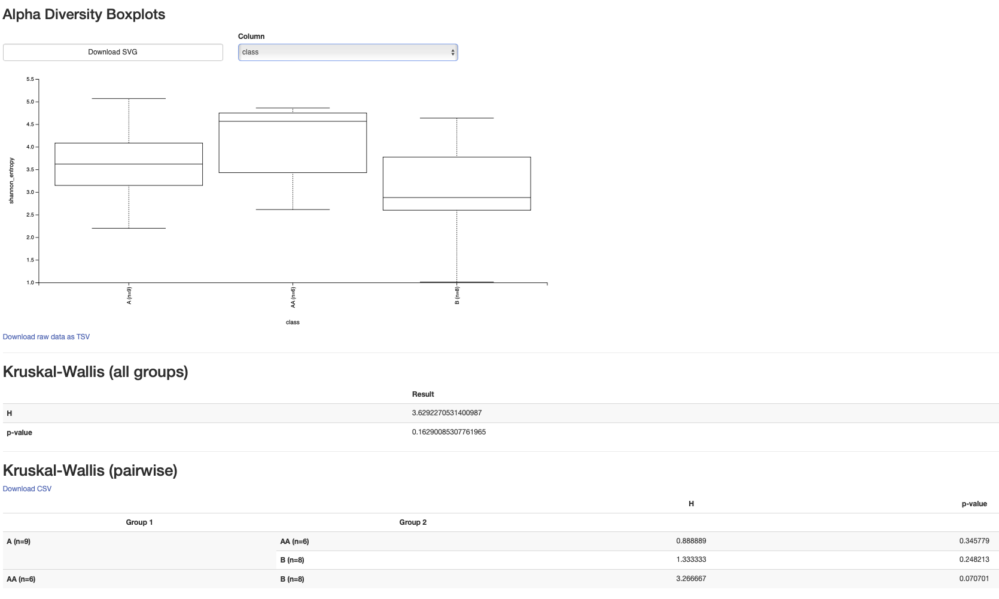
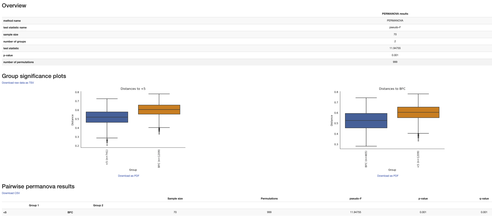

# Metabarcoding guide for mifish

This is an introduction analyzing eDNA metabarcoding samples to evaluate diversity, assign taxonomy, and differential abundance testing. Taxonomy assignments are compared between vsearch (qiime), command line BLAST, and Tronko (a recent phylogenetic approach to taxonomy assignment).   

## Before you start...
For many of the commands below, you will need to replace the text between the < and > symbol with a path and file name. For example, if I made a directory to hold my qiime import output file called 'output' in my home directory, I would replace the '--output-path <path to an output directory>/<a name for the output files>.qza' part with '--output-path /home/unhAW/jtmiller/output/qiime_imported_file.qza' to run the command. 

Once the data has been imported into qiime, all the data will be held in one or two files with the '.qza' extension. However, we will also generate some visualizations of the 'qza' files to view at qiime-view.org. We should give these files a '.qzv' extenstion instead (example: see 2nd command of step 3)

## Overview of pipeline
Steps:
1. Run Fastp to trim the 'poly-g' tails of the reads
2. Import the directory of reads with qiime and save the output in your directory
3. Use the 'cutadapt' program in qiime to trim off the primers
4. Start the denoising the reads (removing the low quality reads/bases)
5. Start here next week's lab

## Before you can run programs like fastp and qiime, create a conda environment with all the necessary applications
[Here](https://github.com/jthmiller/eDNA-metabarcoding-intro/blob/mifish-intro/qiime2-env.yml) is a link to a qiime environment that I use. If you do not have conda or miniconda installed, follow [these](https://conda.io/projects/conda/en/latest/user-guide/install/index.html) instructions.
```
conda env create -f qiime2-env.yml
```
### Once the conda environment is installed, activate it with:
```
conda activate qiime2-2021.4
```
Once you've activated an environment, it should be listed on your command line instead of 'base'. See the example below.
```
(base) jtmiller@ron:~$ conda activate qiime2-2022.8
QIIME is caching your current deployment for improved performance. This may take a few moments and should only happen once per deployment.
(qiime2-2022.8) jtmiller@ron:~$ 
```


## FASTQ sample QA/QC
1. Fastp is used to trim off the poly-G tail commonly found in amplicon nova-seq data. Run the fastp script by replacing the paths (the first one is to the directory of fastq files to trim, and then the path to your output directory that you made to store the trimmed fastqs). Copy the fastp.sh file to your project directory :
```
cp /tmp/gen711_project_data/fastp.sh <path to github directory>/fastp.sh
chmod +x <path to github directory>/fastp.sh
```
The fastp script need 3 things:
1. the poly-g length cutoff
2. the directory of the reads to trim
3. the directory that you will store the reads in

```
### For cyano, fish, and algae 
<path to github directory>/fastp.sh 150 <1.path to fastq directory>  <3.path to your output directory>
```
2. Next, import the directory of poly-G trimmed FASTQ files into a single 'qiime file' with the 'qza' extension with the 'qiime tools import' command below. If you are doing the Fecal transplant study, you will need to run this command twice, once for the demux-1 directory and once for the demux-2 directory. Give the output a different name the second time you run it ( such as 'demux-1.qza' and 'demux-2.qza')
```
qiime tools import \
   --type "SampleData[PairedEndSequencesWithQuality]"  \
   --input-format CasavaOneEightSingleLanePerSampleDirFmt \
   --input-path <path to your output directory of trimmed fastqs> \
   --output-path <path to an output directory>/<a name for the output files> \
```
If you are doing the FMT study, you will need to do this twice- once for each input directory. Name the file output different names (with the --output-path option) 

3. Using the primer sequence, qiime's 'cutadapt' plugin removes the primer and adapters of each pair of sequences. You need to select the correct primers to provide qiime and cutadapt. A second 'qza' output file is created for the cutadapt trimmed data. Name it something that makes sense and add the 'qza' extension, so the output path should look something like: /path/to/your/output/directory/cutadapt-sequences.qza. Run the 'demux summarize' on this file to make a summary.qzv file to view later.

The primer list can be found [here](primer-list.md)

```
qiime cutadapt trim-paired \
    --i-demultiplexed-sequences <path to the file from step 2> \
    --p-cores 4 \
    --p-front-f <the forward primer sequence> \
    --p-front-r <the reverse primer sequence> \
    --p-discard-untrimmed \
    --p-match-adapter-wildcards \
    --verbose \
    --o-trimmed-sequences <path to an output directory>/<name for the output files>.qza

qiime demux summarize \
--i-data <path to the file from step above> \
--o-visualization  <path to an output directory>/<a name for the output files>.qzv 
```

## Denoising 
- Sequences can be denoised using qiime, which calls the R package 'dada2'. Denoising learns the error rate from the base call quality of the samples, and tries to fix sequencing errors when possible. Read pairs are merged into a single sequence when they sufficiently overlap and align. Denoising output is another qiime object that contains a table of the counts for each unique sequence (called ASVs, rows of table) found among the samples (columns, each sample name taken from the fastqs). The ASV sequences and the ASV ids are stored in the 'rep-seqs.qza'. The table of counts for each ASV is stored in the 'feat-table.qza' file. Both objects can be exported to a human readable format (FASTA) to visually inspect the sequences and tables. Or, qiime has a number of summary functions that can be applied to the qza files. Qiime summaries and plots can be viewed [here](https://view.qiime2.org)

Remember: the input for many of these commands is the output from the previous command. In the example below, the input '--i-demultiplexed-seqs <output path>/cutadapt-sequences-1.qza' is indicated by the '--i' part. This file was the output that you made with qiime cutadapt above with '--o-trimmed-sequences <output path>/cutadapt-sequences-1.qza'

The trunclenf and trunclenr can be found in the same file that you found the primer sequences [here](primer-list.md). The truclenf and trunclenr are different for each of the projects (see primer list)

```
qiime dada2 denoise-paired \
    --i-demultiplexed-seqs <output path>/cutadapt-sequences-1.qza  \
    --p-trunc-len-f  <trunclenf> \
    --p-trunc-len-r <trunclenr> \
    --p-trim-left-f 0 \
    --p-trim-left-r 0 \
    --p-n-threads 4 \
    --o-denoising-stats <output path>/denoising-stats-1.qza \
    --o-table <output path>/feature_table-1.qza \
    --o-representative-sequences <output path>/rep-seqs-1.qza

qiime metadata tabulate \
    --m-input-file <output path>/denoising-stats.qza \
    --o-visualization <output path>/denoising-stats.qzv

qiime feature-table tabulate-seqs \
        --i-data <output path>/rep-seqs.qza \
        --o-visualization <output path>/rep-seqs.qzv
```

## Taxonomy assignment 
- Taxonomy assignment can be performed several ways. We've found that the best taxonomy assignment strategy differs between primer and reference databases. 
```
qiime feature-classifier classify-sklearn \
  --i-classifier /tmp/gen711_project_data/reference_databases/classifier.qza \
  --i-reads <output path>/rep-seqs.qza \
  --o-classification <output path>/taxonomy.qza

### Barplot 
qiime taxa barplot \
     --i-table <output path>/feature_table.qza \
     --i-taxonomy <output path>/taxonomy.qza \
     --o-visualization <output path>/my-barplot.qzv

```

#### Metadata and background info
Each project has a metadata file that contains info about each sample- such as the lake the sample came from, or whether the sample came from a 'stool' sample or a sample collected by 'swab' (as in the FMT). We use this info to make comparisons for the results. To include this in your barplots, re-run the barplot command from above, and include the '--m-metadata-file' optional input.

```
qiime feature-table filter-samples \
  --i-table feature_table.qza \
  --m-metadata-file metadata.tsv \
  --o-filtered-table feature_table_filtered.qza

qiime taxa barplot \
     --i-table feature_table_filtered.qza \
     --m-metadata-file sample-metadata.tsv \
     --i-taxonomy taxonomy.qza \
     --o-visualization filtered-barplot.qzv
```

## 7. Diversity analysis and phylogenetic placement of ASVs
```
#### Filtered phylogenetic tree
qiime phylogeny align-to-tree-mafft-fasttree \
  --i-sequences rep-seqs.qza \
  --o-alignment alignments \
  --o-masked-alignment masked-alignment \
  --o-tree unrooted-tree \
  --o-rooted-tree rooted-tree \
  --p-n-threads 4

# same as barplot metadata
qiime diversity core-metrics-phylogenetic \
  --i-phylogeny rooted-tree.qza \
  --i-table feature_table.qza \
  --p-sampling-depth 500 \
  --m-metadata-file metadata.tsv  \
  --p-n-jobs-or-threads
  --output-dir core-metrics
```

## The command above creates 'core-metrics' folder. If you need to re-run it, you might need to remove the core-metrics folder to do so. be careful with 'rm', you could delete your whole home directory (and that is why we make scripts and store things at githb). To remove the 'core-metrics' folder run only:
```
rm -fR core-metrics/
```

The commands below will give you a bunch of plots to view at 'qiime-view.org', including PCAs (as we went over in class) and boxplots to compare between treatments. I'd highly reccommend trying to run these commands on your data for more results to talk about in your presentation. 

```
qiime feature-table relative-frequency \
  --i-table core-metrics/rarefied_table.qza \
  --o-relative-frequency-table core-metrics/relative_rarefied_table

qiime diversity pcoa-biplot \
  --i-features core-metrics/relative_rarefied_table.qza \
  --i-pcoa core-metrics/unweighted_unifrac_pcoa_results.qza \
  --o-biplot core-metrics/unweighted_unifrac_pcoa_biplot

qiime emperor biplot \
  --i-biplot core-metrics/unweighted_unifrac_pcoa_biplot.qza \
  --m-sample-metadata-file metadata.tsv \
  --o-visualization core-metrics/unweighted_unifrac_pcoa_biplot
```


### Very helpful interactive diversity comparison plots
```
qiime diversity alpha-group-significance \
  --i-alpha-diversity core-metrics/shannon_vector.qza \
  --m-metadata-file metadata.tsv \
  --o-visualization core-metrics/alpha-group-significance

qiime diversity beta-group-significance \
  --i-distance-matrix core-metrics/unweighted_unifrac_distance_matrix.qza \
  --m-metadata-file metadata.tsv \
  --m-metadata-column <column_in_metadata_that_groups_replicates>  \
  --p-pairwise \
  --o-visualization core-metrics/unweighted_unifrac-beta-group-significance
```





